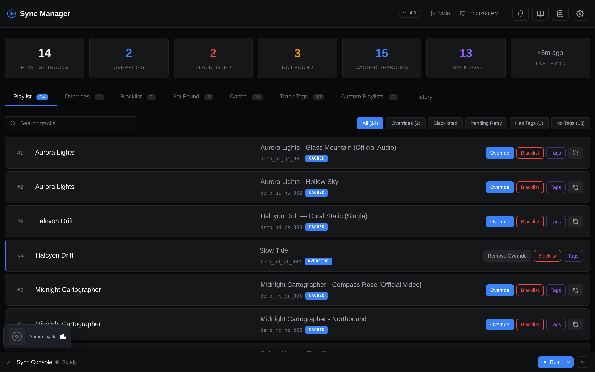

# Last.fm &rarr; YouTube Music

**A self-hosted music dashboard that turns your Last.fm scrobbles into intelligently curated YouTube Music playlists - and keeps them that way.**

YouTube Music's *Replay Mix* was my go-to for playing my current favorites - whatever I'd actually been listening to most lately. The problem is how little it really does: hit shuffle and you get one random track, then the rest drop straight back into their original order, there's no way to blacklist a song you're sick of, and there's no insight into how it picks anything. So I rebuilt it properly. This tool reads your Last.fm history, finds the right *official* upload on YouTube Music for each track (skipping live versions, remixes, nightcore, sped-up, 8D, etc.), weights the result by what you've *actually* been listening to lately, and keeps the playlist in sync on whatever schedule you set - with every step documented and fully configurable, a real blacklist to drop tracks for good, and a lot more than a single playlist.

On top of that you get **weekly snapshot playlists** that archive your listening habits, **tag-based genre playlists** auto-filled from your Last.fm tags, and a **full web dashboard** with a first-launch setup wizard, built-in scheduler, sync console, history database, webhooks, encrypted backup/restore, and PWA install - so after the initial 5-minute install you never have to touch a terminal or config file again.

## Get started in ~5 minutes

The Docker setup includes a web dashboard, a setup wizard, and a built-in scheduler. No terminal needed after install.

&rarr; **[Quick Start (Docker)](https://locko2901.github.io/lastfm-to-ytm/quickstart/)**

Prefer not to use Docker? There's a [standalone CLI install](https://locko2901.github.io/lastfm-to-ytm/cli-install/) too. It runs the same sync engine; you handle scheduling yourself with cron/systemd. The Docker path is recommended for almost everyone.

## Highlights

- **Web dashboard** to configure everything, browse your playlist, fix wrong matches, and watch syncs run live.
- **Smart matching** that prefers official Songs over user uploads and rejects nightcore, sped-up, slowed, 8D, etc.
- **Recency + play-count weighting** so the playlist reflects what you're *actually* listening to right now.
- **Weekly snapshot playlists** so you build a long-term archive of how your taste evolves.
- **Tag-based playlists** (e.g. *"Breakcore Mix"*, *"Chill Electronic"*) auto-filled from your Last.fm tags.
- **Built-in scheduler, webhooks, encrypted backup** - and more in the [full docs](https://locko2901.github.io/lastfm-to-ytm/).

## Documentation

Full documentation lives at **[locko2901.github.io/lastfm-to-ytm](https://locko2901.github.io/lastfm-to-ytm/)**.

## Credits

- [ytmusicapi](https://ytmusicapi.readthedocs.io/) - YouTube Music API wrapper
- Thanks to the Last.fm and YouTube Music communities.

## License

MIT - see [LICENSE](LICENSE) for details.
