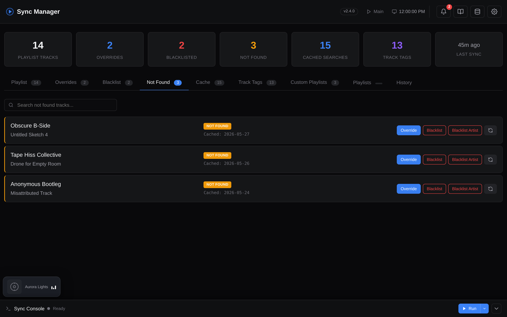
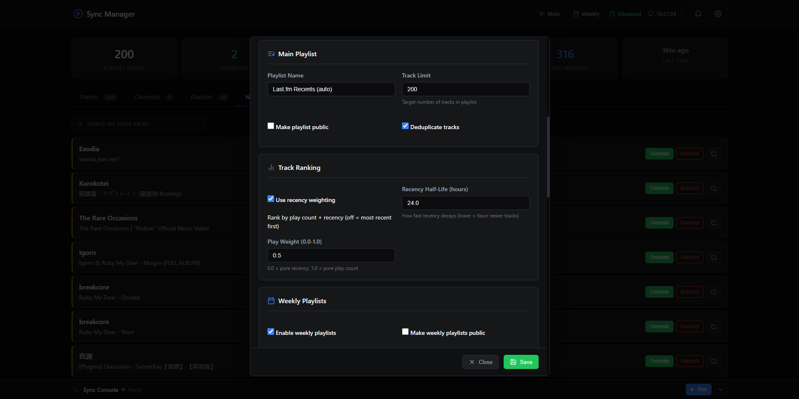
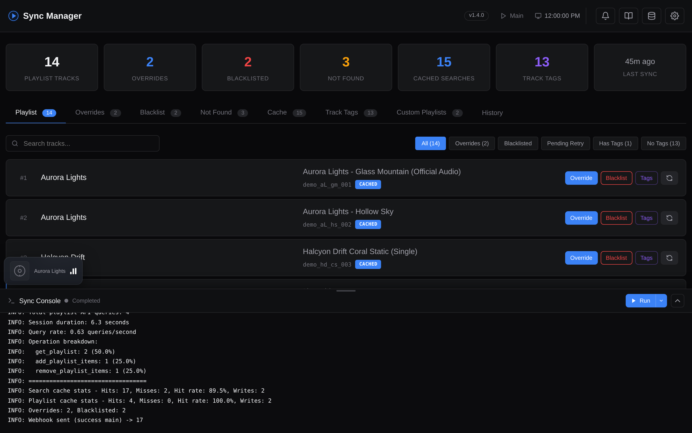
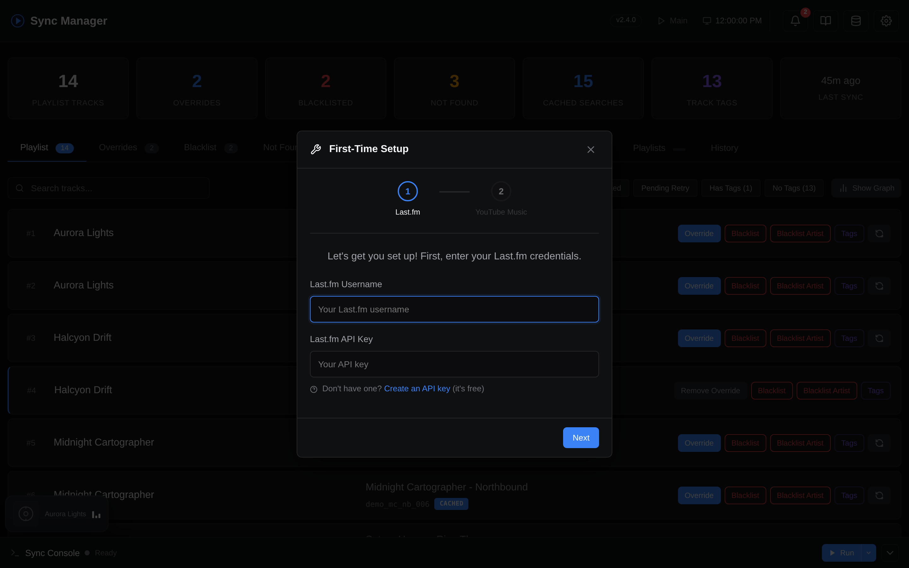

# Web Dashboard

The web dashboard is always included with the Docker setup. It provides a full management interface - **everything** can be configured, inspected, and triggered from the UI without ever touching a config file, JSON, or terminal.

!!! tip "Running without Docker?"
    You can run the web dashboard manually too:
    ```bash
    pip install ".[web]"
    pybabel compile -d web/translations
    lastfm-ytm-web
    ```
    This starts the same dashboard at `http://localhost:2002`. You'll still need to handle process management yourself (e.g., keep it running via systemd or screen).

    The `pybabel compile` step is required because the compiled `.mo` catalogs are gitignored - without them, Flask-Babel falls back to source strings and the language dropdown won't switch locales. The Docker image runs this automatically during build.

## Dashboard Features

- **Playlist tab** - View every track in your synced playlist with its matched YouTube Music link, source (cache/search/override), and status badges. Filter by overrides, blacklisted, or pending retry.
- **Overrides tab** - Add, edit, or remove manual search overrides directly. Paste a YouTube Music URL or video ID and the dashboard extracts and validates it.
- **Blacklist tab** - Manage blacklisted tracks from the UI. Blacklisted tracks are excluded entirely from playlist generation. **Blacklist Artist** excludes every track by an artist (the artist blacklist also applies to custom playlists; each playlist additionally supports its own per-artist blacklist in the editor).
- **Not Found tab** - See all tracks where the search couldn't find a match. One-click to add an override or blacklist entry for any of them.

??? example "Screenshot: Not Found tab"
    

- **Cache tab** - Browse all cached search results, see which video each track resolved to, and clear individual entries or the full cache.
- **Playlists tab** - Manage the playlists this tool created on YouTube Music. On open it lists everything already in the playlist cache (main, weekly, custom), tagged by category. **Discover playlists** scans your library for autogenerated playlists that aren't tracked yet (e.g. ones created before caching, or renamed) and lets you tick which to track - IDs only, leaving templates intact. Each card has **Open** (YouTube Music) and **Delete** (removes from YTM and cache). **Prune old weeklies** deletes weekly snapshots beyond `WEEKLY_KEEP_WEEKS` on demand (this also happens automatically every main sync). Deletes are irreversible and require valid YTM auth.
- **Cache management modal** - Header button (database icon) opens a dedicated modal with three tabs: **Search cache** (bulk select/delete entries, clear all not-found, clear everything), **Tag cache** (filter by artist/title/tag name, bulk delete), and **Playlist cache** (expand each cached playlist, remove individual tracks or whole playlist entries). Use this for surgical cleanup when a single bad cache entry is causing repeated wrong matches.
- **Settings modal** - Edit all configuration (Last.fm credentials, playlist options, search tuning, weekly settings, etc.) without touching `.env`. Changes take effect on the next sync.

??? example "Screenshot: Settings modal"
    

- **Sync console** - Trigger a sync manually and watch real-time output in a resizable terminal drawer. Stop a running sync at any time. If you reload the page mid-sync, the console automatically reattaches to the running stream instead of going idle.
- **Update pill** - The header shows your current build (`vX.Y.Z` on stable, `dev·<sha>` on dev) and lights up when an update is available. On **stable** that means a newer release tag has been published, and clicking the pill opens the GitHub release/changelog. On **dev** it means the upstream `main` branch has new commits since your build, and clicking the pill opens the GitHub commit compare view (or the branch's commit log when the build SHA isn't known). The check runs against the GitHub API and is cached on disk for 6h. See [Release Channels](channels.md) and [Updating](docker-reference.md#updating).

??? example "Screenshot: Sync console"
    

- **Stats bar** - At-a-glance counts: playlist tracks, overrides, blacklisted, not found, cached searches, and last sync time.
- **YTM authentication** - Run `ytmusicapi browser` authentication interactively through the web UI - no terminal access needed.
- **First-time setup wizard** - Guides you through `.env` creation, Last.fm credentials, and YouTube Music auth on first launch.

??? example "Screenshot: Setup wizard"
    

## Integrated Scheduler

The web dashboard includes a built-in scheduler (powered by APScheduler) so you don't need cron or systemd:

- **Interval mode** - Run every N hours, optionally anchored to a start time (e.g., every 6 hours starting at midnight)
- **Cron mode** - Use a cron expression for full control (e.g., `0 */6 * * *`)
- **Custom sync** - Optionally run custom playlist sync (tag & artist playlists) after each scheduled main sync via `AUTO_TAG_SYNC_ENABLED`. Use `AUTO_TAG_SYNC_FREQUENCY` to run it every N main syncs (e.g., `2` = every other sync).
- Configure via the Settings modal in the UI, or via environment variables:

| Variable | Default | Description |
|----------|---------|-------------|
| `AUTO_SYNC_ENABLED` | `false` | Enable the built-in scheduler |
| `AUTO_SYNC_TYPE` | `interval` | `interval` or `cron` |
| `AUTO_SYNC_INTERVAL_HOURS` | `6` | Hours between syncs (interval mode) |
| `AUTO_SYNC_START_TIME` | | HH:MM anchor for interval start (e.g., `00:00`) |
| `AUTO_SYNC_CRON` | `0 */6 * * *` | Cron expression (cron mode) |
| `AUTO_TAG_SYNC_ENABLED` | `false` | Also sync custom playlists (tags & artists) after each scheduled run |
| `AUTO_TAG_SYNC_FREQUENCY` | `1` | Run custom playlist sync every N main syncs (`1` = every time) |

The dashboard header shows a "Scheduled" indicator and the next run time when the scheduler is active.

!!! info "For developers"
    Route handlers, panel endpoints, the scheduler implementation, and the SSE sync stream are documented in [Web Dashboard Internals](web-internals.md).

## PWA Support

The dashboard is installable as a Progressive Web App. In supported browsers, you can add it to your home screen or install it as a standalone app for quick access.

## Custom Theme

Override any of the dashboard's CSS color tokens to build your own color scheme on top of the built-in **Dark** or **Light** themes.

- Open **Settings &rarr; Display &rarr; Customize colors** to launch the color picker modal.
- Each row exposes a swatch + hex input for one CSS variable (backgrounds, text, accent, semantic, borders).
- Changes preview live as you edit; nothing is persisted until you click **Save**.
- The **Use custom colors** checkbox in Settings toggles the entire override layer on or off without losing your saved values.

### Per-base customization

Customizations are stored **per base theme**. Editing while Dark is active updates the Dark overrides; switching to Light and editing again creates an independent Light override set. Switching between Dark and Light at runtime swaps in the appropriate override bucket automatically.

The **Reset to parent** button inside the modal clears only the *current* base theme's overrides, restoring it to the built-in colors while leaving the other base theme untouched.

### Persistence

Overrides are saved server-side and applied to every page render, so the first paint already reflects your scheme (no flash of default theme). Per-base override storage paths and the underlying API are documented in [Web Dashboard Internals](web-internals.md#theme-overrides).

### Backup / restore

The theme override file is included in the [Teleporter](teleporter.md) cache picker, so you can back up and restore your color scheme together with the rest of your configuration. It can also be exported as standalone JSON from the modal's **Export** / **Import** buttons (useful for sharing themes between users or instances).

## Data Export &amp; Import

**Settings &rarr; Data Management** is the single place to back up or move data, organised by scope:

| Group | Format | Covers |
|-------|--------|--------|
| **Overrides &amp; Blacklist** | Plain JSON | Manual fixes, tag overrides, blacklist |
| **History Database** | Plain JSON dump | All of `tracks`, `syncs`, `actions` (only shown when `HISTORY_DB_ENABLED=true`) |
| **Teleporter** | Encrypted bundle (AES-256-GCM) | Everything above plus caches - for migrating between instances |

The two plain-JSON options are unencrypted - use Teleporter when crossing trust boundaries. History-database **Import** asks whether to **Merge** (idempotent: re-importing the same file inserts zero new rows) or **Replace** (wipes the DB first).

### Plain JSON Export &amp; Import

Export overrides, blacklist, and/or tag overrides as plain JSON. Useful for quick backups or sharing configuration between instances.

**Export** returns a JSON file with an `_export_meta` header and one or more data sections:

| Type | Includes |
|------|----------|
| `all` | Overrides + blacklist + tag overrides |
| `overrides` | Search overrides only |
| `blacklist` | Blacklisted tracks only |
| `tag_overrides` | Tag overrides only |

**Import** accepts the same JSON format. Entries are validated and merged into the existing config:

- Override entries must have `artist`, `title`, and a valid 11-character YouTube `video_id`.
- Blacklist entries must have `artist` and `title`.
- Tag override entries must have `artist`, `title`, and a non-empty `tags` list.

Duplicate keys are overwritten (last write wins). Existing entries not present in the import file are left untouched.

### History Database Export &amp; Import

When `HISTORY_DB_ENABLED=true`, a **History Database** row appears with **Export** and **Import** buttons. Export downloads the full DB as a JSON dump; import opens a modal to choose **Merge** (idempotent - safe to re-run) or **Replace** (wipes existing data first). Full details in [History Database](history.md#maintenance).

### Encrypted Export (Teleporter)

Export your full configuration (including `.env`, `browser.json`, caches) as a password-encrypted binary file. See [Teleporter](teleporter.md).
