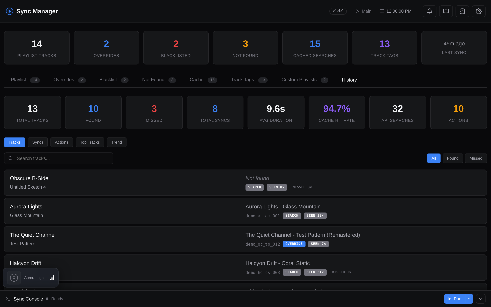

# History Database

An optional local SQLite database that tracks all synced songs, actions, and sync runs for audit and visibility.

When enabled, a dedicated **History** tab appears in the web dashboard with five sub-views:

- **Tracks** - every song seen, with how often it was found vs. missed, first/last seen dates, and direct links to the matched video
- **Syncs** - every sync run with duration, track counts, cache hit rate, and API call totals
- **Actions** - every user action (override added, blacklist added, cache cleared, etc.)
- **Top Tracks** - your most-found tracks across the whole history
- **Trend** - sync activity and match rates over time

Plus a stat-card bar across the top (totals, average sync duration, cache hit rate, API searches, action count) that doubles as a quick filter. You don't need to open the database file directly - everything is browsable in the UI.

??? example "Screenshot: History tab"
    

## What It Tracks

The database stores three types of records:

- **Tracks** - every song the sync engine encounters, including artist, title, matched video ID, match score, resolution source (cache/search/override), and how many times it was found or missed
- **Syncs** - a record of every sync run with timestamps, duration, track counts, API usage stats (searches, playlist operations, cache hits/misses, override hits), and final status
- **Actions** - user-initiated actions like adding overrides, blacklisting, or clearing cache entries (logged by the web dashboard)

When `HISTORY_MAX_SIZE_MB` is set to a non-zero value, the database auto-prunes the oldest records when the file exceeds the specified size. When `HISTORY_RETENTION_DAYS` is set, every successful main sync also deletes any `syncs` and `actions` rows older than the cutoff and `VACUUM`s the file to reclaim space. Track rows are kept (they are cumulative lookup state, not history).

## "Seen" vs "Played"

The dashboard surfaces two different per-track counters that are easy to confuse because they often disagree for the same song:

- **Seen** (the `times_found` counter, shown as the `seen N×` badge and the **Seen** row in the **Track Details** modal) counts how many times the **sync engine resolved this track to a YouTube Music video**. It is incremented once per sync run that encounters the track, so a song that lingers in your recent-tracks window across many syncs accumulates a high "seen" count regardless of how often you actually listened to it. It is a *pipeline/lookup* metric, not a listening metric.
- **Played** (the `N× played` badge) is your **lifetime Last.fm scrobble count** and only appears when the [local Last.fm history database](local-history.md) is enabled. It reflects how many times you actually listened to the track.

Because they measure different things, **"Seen" and "Played" are expected to differ** - a track can show, say, `484× seen` in the Track Details modal while the Top Tracks list shows `150× played`. "Seen" tends to be higher when frequent syncs keep re-resolving the same track; "Played" only ever moves when you genuinely listen to the song again.

## Maintenance

The **History Database** section in **Settings** exposes the DB-only maintenance actions:

- **Backfill from Cache** - one-shot import of your existing search cache and overrides as `cache_backfill` / `override_backfill` rows so old lookups show up in the dashboard.
- **Vacuum &amp; Prune** - runs `prune_by_age()` (if `HISTORY_RETENTION_DAYS > 0`), then `prune_if_oversized()` (if `HISTORY_MAX_SIZE_MB > 0`), then a final `VACUUM` to reclaim disk space. Useful after lowering either limit, or as a manual housekeeping trigger between syncs. A `history_vacuum` action is logged with the row counts that were removed.
- **Clear History Database** - wipes every row from `tracks`, `syncs`, and `actions`, then `VACUUM`s. Irreversible.

Backup and restore live one section down in **Settings &rarr; Data Management &rarr; History Database** (visible only when the DB is enabled):

- **Export** - downloads the entire database as a JSON dump (`history-export-YYYYMMDDTHHMMSS.json`) containing every row of `tracks`, `syncs`, and `actions`. Plain text JSON, no encryption - treat it like a personal listening journal.
- **Import** - uploads a previously exported JSON dump. A modal asks whether to **Merge** or **Replace**:
    - **Merge** is idempotent. `tracks` are upserted on `(artist, title)` - counters take the `MAX` of both sides and `first_seen` / `last_seen` widen to cover both sides. `syncs` are deduped on `(started_at, sync_type)` and `actions` are deduped on `(timestamp, action_type, artist, title, video_id, detail)`, so importing the same file twice will insert zero new rows the second time and counters won't double. The toast reports rows actually inserted.
    - **Replace** wipes the existing database first, then inserts everything from the file.

The same JSON dump is what the [Teleporter](teleporter.md) embeds when you tick the **History database** checkbox - import is always done in `merge` mode there to avoid wiping a working instance.

## Configuration

**Docker**: Toggle via **Settings &rarr; History Database**.

**CLI**: Add to your `.env`:

```bash
HISTORY_DB_ENABLED=false               # Enable/disable the history database
HISTORY_DB_FILE=cache/history.db       # Path to the database file
HISTORY_MAX_SIZE_MB=0                  # Auto-prune oldest records when exceeded (0 = unlimited)
HISTORY_RETENTION_DAYS=0               # Auto-delete syncs & actions older than N days after each sync (0 = keep forever)
```

| Variable | Default | Description |
|----------|---------|-------------|
| `HISTORY_DB_ENABLED` | `false` | Track all songs, syncs, and actions in a local SQLite DB |
| `HISTORY_DB_FILE` | `cache/history.db` | Path to the history database file |
| `HISTORY_MAX_SIZE_MB` | `0` | Auto-prune oldest records when the file exceeds this size (`0` = unlimited) |
| `HISTORY_RETENTION_DAYS` | `0` | After each sync, delete `syncs` &amp; `actions` rows older than N days (`0` = keep forever). `tracks` are always retained. |
