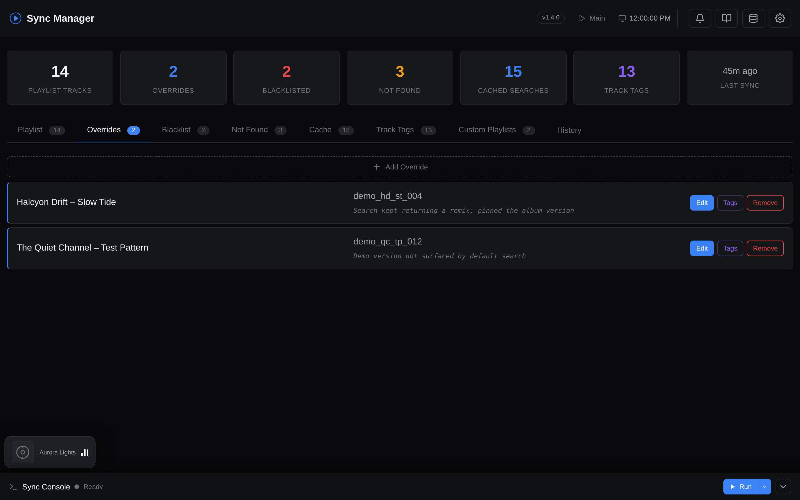

# Search Overrides

Sometimes the automatic search may fail to find a song or may find the wrong version. You can override specific searches or blacklist tracks entirely.

**Docker**: Use the web dashboard - the Overrides, Blacklist, and Not Found tabs let you manage these with a few clicks.

**CLI**: Edit `config/search_overrides.json` directly.

??? example "Screenshot: Overrides tab"
    

---

## Setup

```bash
# Create the overrides file (if it doesn't exist)
cp config/search_overrides.json.example config/search_overrides.json
```

## Adding an Override

Find the video ID from a YouTube Music URL - it is the part after `v=` (e.g., `https://music.youtube.com/watch?v=dQw4w9WgXcQ` &rarr; `dQw4w9WgXcQ`):

```json
{
  "_overrides": {
    "rick astley|never gonna give you up": {
      "artist": "Rick Astley",
      "title": "Never Gonna Give You Up",
      "video_id": "dQw4w9WgXcQ",
      "reason": "Search found wrong version"
    }
  },
  "_blacklist": {
    "artist name|unwanted track": {
      "artist": "Artist Name",
      "title": "Unwanted Track",
      "reason": "Don't want this in playlist"
    }
  }
}
```

## Blacklisting

Blacklisted tracks are excluded entirely from playlist generation. They are checked *before* overrides and the search cache, so a blacklisted track will never appear in any playlist regardless of other entries.

!!! info "Resolution order"
    blacklist &rarr; overrides &rarr; search cache &rarr; YouTube Music API. Overrides and blacklist entries never expire (you remove them manually), and both also apply to [custom tag playlists](tag-playlists.md).
