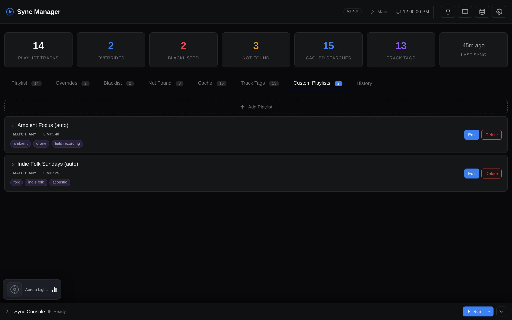

# Custom Tag Playlists

Create automatic YouTube Music playlists based on Last.fm tags and genres. You can define multiple tag-based playlists that fill themselves with matching tracks from your scrobble history.

For example, define a "Breakcore Mix" playlist that only includes tracks tagged `breakcore` or `drill and bass` on Last.fm, or a "Chill Electronic" playlist that requires both `electronic` and `ambient` tags.

??? example "Screenshot: Custom Playlists editor"
    

!!! tip "Related"
    Tag playlists honor the same `_overrides`, `_blacklist`, and `_blacklist_artists` you set up in [Search Overrides](overrides.md), plus **per-playlist** `blacklist`/`blacklist_artists` fields (see [Configuration](#configuration) below). Use tag overrides when Last.fm's tags are wrong; use search overrides when the *matched video* is wrong.

## How Tags Are Resolved

The tag system follows the same cache-first approach as the main sync:

1. **Tag overrides** - check `config/tag_overrides.json` (user manual fixes). If the override mode is `"replace"`, the override tags are used directly and steps 2-3 are skipped.
2. **Tag cache** - check `cache/.tag_cache.json` (90-day TTL, configurable via `TAG_CACHE_TTL_DAYS`)
3. **Last.fm API** - fetch via `track.getTopTags`, falling back to `artist.getTopTags` if track-level tags are unavailable

After fetching, `"add"` mode tag overrides are merged into the result (this allows supplementing Last.fm's tags without replacing them entirely).

Tags with fewer votes than `TAG_MIN_COUNT` (default: 10) are filtered out to avoid noise.

If backfilling is enabled and a playlist has not reached its target track count after filtering, the tool automatically fetches more scrobbles and repeats until the limit is met or no more data is available.

---

## Configuration

**Docker**: Use the web dashboard to create and manage tag playlists. Tag sync can be triggered manually from the UI, or automatically after each scheduled main sync via `AUTO_TAG_SYNC_ENABLED` and `AUTO_TAG_SYNC_FREQUENCY` (see [Configuration](configuration.md)).

**CLI**: Edit `config/custom_playlists.json` directly:

### 1. Create the config file

```bash
cp config/custom_playlists.json.example config/custom_playlists.json
```

### 2. Define your playlists

```json
{
  "playlists": [
    {
      "name": "Breakcore Mix (auto)",
      "tags": ["breakcore", "drill and bass"],
      "match": "any",
      "limit": 50,
      "backfill": true,
      "blacklist": []
    },
    {
      "name": "Ambient Electronic (auto)",
      "tags": ["ambient", "electronic"],
      "match": "all",
      "limit": 30,
      "backfill": true,
      "blacklist": ["artist name|unwanted track"],
      "blacklist_artists": ["unwanted artist"]
    }
  ]
}
```

| Field | Required | Description |
|-------|----------|-------------|
| `name` | yes | Playlist name on YouTube Music |
| `description` | no | Optional playlist description (empty = auto-generated) |
| `tags` | yes | Last.fm tags to match against |
| `match` | no | `"any"` (track has at least one tag, default) or `"all"` (track has every tag) |
| `limit` | no | Target number of tracks (default: `50`) |
| `backfill` | no | Fetch more scrobbles if filtering doesn't reach the limit (default: `true`) |
| `blacklist` | no | Per-playlist exclusions as `"artist\|title"` (lowercase) |
| `blacklist_artists` | no | Per-playlist artist exclusions (lowercase artist names) |

### Environment Variables

| Variable | Default | Description |
|----------|---------|-------------|
| `CUSTOM_PLAYLISTS_FILE` | `config/custom_playlists.json` | Path to playlist definitions |
| `TAG_CACHE_TTL_DAYS` | `90` | Days before cached tags expire |
| `TAG_MIN_COUNT` | `10` | Minimum Last.fm tag count threshold |
| `TAG_SLEEP_BETWEEN` | `0.25` | Seconds between tag API calls |
| `CUSTOM_PLAYLISTS_PRIVACY` | *(main setting)* | Privacy for tag playlists (`PUBLIC` / `PRIVATE`) |
| `BACKFILL_PASSES` | `3` | Maximum backfill iterations |

---

## Tag Overrides

When Last.fm's tag data is wrong or incomplete, you can manually fix it.

**Docker**: Use the web dashboard's tag management interface.

**CLI**: Edit `config/tag_overrides.json` directly:

### 1. Create the overrides file

```bash
cp config/tag_overrides.json.example config/tag_overrides.json
```

### 2. Add your override

```json
{
  "_overrides": {
    "artist name|song title": {
      "artist": "Artist Name",
      "title": "Song Title",
      "tags": ["breakcore", "electronic"],
      "mode": "add",
      "reason": "Last.fm only has 'electronic', adding 'breakcore'"
    }
  }
}
```

| Field | Description |
|-------|-------------|
| Key | `artist\|title` in **lowercase** |
| `tags` | List of tag names to apply |
| `mode` | `"add"` merges with existing Last.fm tags, `"replace"` overwrites them entirely |
| `reason` | Optional note for your reference |

---

## Running Tag Sync

Tag playlists are synced separately from the main playlist. Use the dedicated entry point:

```bash
python run_tags.py  # or: lastfm-ytm-tags
```

!!! warning
    `python run.py` only runs the main playlist sync. Tag playlists must be triggered separately via `run_tags.py` or from the web dashboard.
