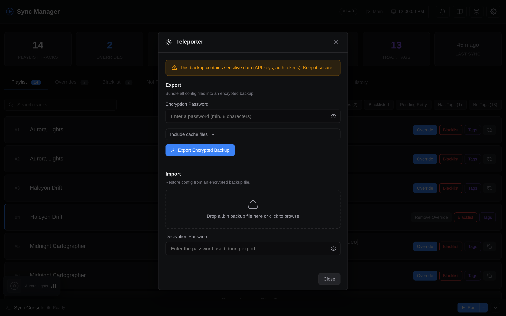

# Teleporter (Encrypted Config Backup)

The Teleporter lets you export and import your entire configuration as a single encrypted file. Useful for migrating to a new server, creating backups, or cloning your setup.

---

## Usage

1. Open **Settings** &rarr; **Data Management** &rarr; **Teleporter**
2. **Export**: enter a password (min. 8 characters), optionally select which cache files to include, click **Export Encrypted Backup**. You get back a `.bin` file.
3. **Import**: drop a `.bin` file, enter the password, click **Preview** to verify contents, then **Restore Backup**.

!!! warning "Security"
    The backup contains sensitive data (API keys, auth tokens). Store it securely and use a strong password.

??? example "Screenshot: Teleporter modal"
    

---

## What's Included

**Always exported:**

- `.env` - all settings (API keys, playlist config, scheduler settings)
- `browser.json` - YouTube Music authentication cookies
- `config/search_overrides.json` - manual search overrides and blacklist
- `config/tag_overrides.json` - tag overrides
- `config/custom_playlists.json` - custom tag playlist definitions

**Optionally exported:**

- `cache/.search_cache.json` - cached YouTube Music search results. Avoids re-searching tracks on a new instance.
- `cache/.playlist_cache.json` - stores playlist IDs and desired track state. Needed to resume syncing without recreating playlists.
- `cache/.tag_cache.json` - cached Last.fm tag lookups. Avoids re-fetching tags for every track.
- `cache/.theme_overrides.json` - your dashboard [custom color scheme](dashboard.md#custom-theme) (per base theme).

---

## How the encryption works

Skip this section unless you want to verify or audit the format.

```
Binary format (v1):
  [4B magic "TPRT"][1B version][1B KDF id][4B mem_cost][4B iterations][4B parallelism]
  [16B salt][12B nonce][ciphertext || 16B GCM auth tag]
```

??? info "Export details"
    1. Collect all selected config/cache files into a JSON bundle
    2. Generate a random 16-byte salt and 12-byte nonce
    3. Derive a 256-bit key using Argon2id (128 MiB memory, 3 iterations, 4 threads)
    4. Build an 18-byte header: 4B magic + version + KDF algorithm + KDF params
    5. Encrypt the JSON bundle with AES-256-GCM, passing the header as AAD
    6. Output = header &Vert; salt &Vert; nonce &Vert; ciphertext &Vert; GCM tag
    7. Download as `.bin` file

??? info "Import details"
    1. Verify the 4-byte magic identifier (`TPRT`)
    2. Read the header to extract version, KDF algorithm, and parameters
    3. Extract salt, nonce, ciphertext, and GCM auth tag
    4. Re-derive the 256-bit key from password + salt (Argon2id params from header)
    5. Decrypt with AES-256-GCM, verifying the full header as AAD
        - Detects wrong password, tampered ciphertext, or modified KDF params
    6. Validate and restore each config file atomically (temp file + rename)

The magic bytes (`TPRT`) identify the file format before any crypto work begins. The full header (magic + KDF params) is authenticated via GCM's AAD mechanism - any modification to the version byte or KDF parameters (e.g. downgrading memory cost) causes decryption to fail. The password is never stored; it exists only in memory during key derivation.
